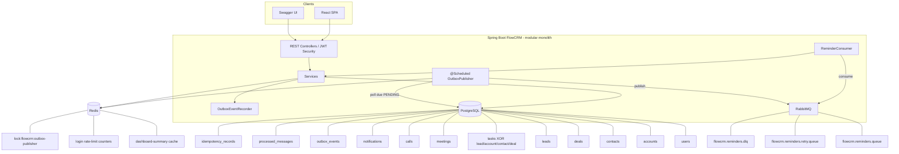

# FlowCRM

A production-oriented Mini CRM / Zoho-lite built for the **Coding Shuttle Build-A-Thon**.

FlowCRM is a **modular Spring Boot backend** (not a microservices split) that uses PostgreSQL, Redis, and RabbitMQ so sales workflows stay correct under retries, duplicate delivery, and multiple app instances.


---

## Product features

| Capability | What it does |
|------------|--------------|
| JWT authentication | Register / login / me; passwords stored with BCrypt |
| Roles | `ADMIN` and `SALES_REP` with role-aware data access |
| React SPA | Vite + React UI for auth, dashboard, accounts, contacts, deals, leads, and tasks (`frontend/`) |
| Accounts | Company records with owner scoping (`ADMIN` all / `SALES_REP` owned) |
| Contacts | People records, optionally linked to an account |
| Deals | Opportunity pipeline (`DealStage`) with validated transitions, amounts, and owner scoping |
| Lead CRUD | Create, list (paginated/filterable), get, update, delete |
| Lead assignment | Defaults to the current user; only `ADMIN` can assign others |
| Lead pipeline | Validated PATCH transitions: `NEW → CONTACTED → QUALIFIED`, with `LOST` from active stages; `CONVERTED` only via convert API |
| Follow-up tasks | Tasks linked to exactly one Lead, Account, Contact, or Deal; `dueAt` / optional `reminderAt`; SPA list/filters/complete/cancel |
| Activity timeline | Per-record activity (created/updated, conversion, tasks, meetings, calls) — not a full audit log |
| Meetings / Calls | Scheduled meetings and planned calls linked to exactly one CRM record |
| Calendar / Workqueue | Aggregated scheduled work and a deterministic next-actions view |
| Global search | Role-scoped search across leads, accounts, contacts, deals, tasks, meetings, and calls |
| Quick create | Header **+ Create** reuses existing create forms/APIs (no extra backend route) |
| In-app notifications | Persistent assignment notifications in PostgreSQL; each user sees only their inbox |
| Scheduled reminders | Reminder times become durable outbox events, then RabbitMQ work (delivery is log-simulated) |
| Dashboard summary | Per-user aggregates (leads, deals/pipeline value, open/overdue tasks, upcoming follow-ups) in API + SPA |
| Analytics | Role-scoped lead/deal/activity metrics, UTC date presets, ADMIN team workload table (`GET /api/v1/analytics/summary`); uncached |
| Flow AI | Optional read-only CRM assistant (`POST /api/v1/assistant/chat`). Context is built server-side with existing role scoping. The LLM never queries the database or mutates records. |

**First-user behavior:** the first registered account becomes `ADMIN`; later registrations become `SALES_REP`.

---

## Engineering features (and why they exist)

These are not decorative patterns—they map to real CRM failure modes.

| Feature | Why it is in FlowCRM |
|---------|----------------------|
| **Durable request idempotency** | Sales UIs and mobile clients retry on timeouts. Without durable keys, a retry can create duplicate leads/tasks (and duplicate reminder schedules). |
| **Transactional outbox** | Reminder scheduling must not “half succeed” (task saved, broker publish failed, or the reverse). Business write + outbox row share one PostgreSQL transaction. |
| **RabbitMQ async processing** | Reminder work should not block HTTP create/update paths or depend on the request thread staying alive until `reminderAt`. |
| **Retry queues** | Transient delivery/processing failures should retry with delay instead of dropping the reminder. |
| **Dead-letter queue (DLQ)** | After repeated failures, poison messages must be isolated for inspection instead of looping forever. |
| **Consumer idempotency (`processed_messages`)** | Brokers can redeliver. FlowCRM treats duplicate `eventId`s as already handled. |
| **Redis dashboard caching** | Dashboard reads are hot and relatively expensive aggregates; a short TTL cache reduces load. |
| **Cache invalidation** | Lead/task/deal mutations clear dashboard cache so summaries do not stay stale after writes. |
| **Redis login rate limiting** | Login is a high-abuse surface; per-IP limits reduce credential stuffing without putting counters in the app JVM. |
| **Redis distributed locking** | Multiple app instances may run the outbox scheduler; a lock prevents concurrent publish of the same batch. |
| **Flyway migrations** | Schema evolves safely and reproducibly across environments. |
| **Swagger / OpenAPI** | Judges and developers can exercise the full JWT-protected API without a frontend. |

---

## Architecture overview

FlowCRM is a **single Spring Boot application** using distributed infrastructure.



Reusable source: [`docs/architecture.mmd`](docs/architecture.mmd) · deeper design notes: [`docs/ARCHITECTURE.md`](docs/ARCHITECTURE.md)

**Reminder publish path:** PostgreSQL `outbox_events` → `@Scheduled OutboxPublisher` (Redis lock) → RabbitMQ → `ReminderConsumer` → simulated delivery + `processed_messages`.

---

## Reminder flow

1. A task is created or updated with a `reminderAt` (or completed/cancelled/rescheduled).
2. In the **same DB transaction** as the task write, FlowCRM records a `FOLLOW_UP_SCHEDULED` outbox row (or marks prior PENDING schedules `SUPERSEDED`).
3. The outbox row stays `PENDING` until `available_at` (= `reminderAt`). Future reminders are **not** published early.
4. `@Scheduled OutboxPublisher` tries to acquire Redis lock `lock:flowcrm:outbox-publisher`.
5. The publisher sends due events to exchange `flowcrm.reminders.exchange` with routing key `reminder.scheduled`.
6. `ReminderProcessingService` checks the live task: missing / not `OPEN` / cleared reminder / mismatched `reminderAt` ⇒ **stale** (acknowledged without delivery, no retry/DLQ).
7. Otherwise it runs `LoggingReminderDeliveryService` (log-based simulation).
8. On processing failure, `ReminderConsumer` republishes to `reminder.retry` (TTL delay, then back to main).
9. After `app.reminders.max-attempts` (default **3**), the message is routed to `reminder.dlq` → `flowcrm.reminders.dlq`.
10. `processed_messages.message_id` (= outbox event id) prevents duplicate delivery side effects.

**Superseded / stale reminders:** Reschedule, clear, complete, cancel, or delete marks earlier PENDING outbox rows `SUPERSEDED` so they are never published. Messages already in flight that no longer match the task are treated as stale and safely skipped.

---

## Idempotency flow

Optional header on:

- `POST /api/v1/leads`
- `POST /api/v1/tasks`
- `POST /api/v1/accounts`
- `POST /api/v1/contacts`
- `POST /api/v1/deals`
- `POST /api/v1/leads/{id}/convert`
- `POST /api/v1/meetings`
- `POST /api/v1/calls`

| Concept | Behavior |
|---------|----------|
| Header | `Idempotency-Key` (optional; blank rejected; max 255) |
| Scope | `(user_id, operation, idempotency_key)` — not global across users/operations |
| Fingerprint | SHA-256 of canonical JSON request payload (task relation ids are part of the body) |
| Claim | PostgreSQL unique constraint + `INSERT … ON CONFLICT DO NOTHING` |
| Same key + same body | Replay original **201** (creates) or **200** (lead convert) body/resource id |
| Same key + different body | **409** Conflict |
| Concurrent same key | Only the claim owner executes business create |

Because task create + outbox write are one transactional unit for the claim owner, an idempotent **replay** cannot create a second task or a second `FOLLOW_UP_SCHEDULED` outbox row.

---

## Redis features

### Dashboard caching
- Cache name: `dashboard-summary`, keyed by authenticated user id
- Default TTL: **60 seconds** (`app.cache.dashboard-ttl-seconds`)
- Lead/task/deal/conversion mutations call cache eviction (`allEntries`) so ADMIN and assignee views stay coherent
- **Analytics** (`GET /api/v1/analytics/summary`) is uncached so date-range and ADMIN filters stay exact; dashboard remains the Redis hot path

### Login rate limiting
- Per client IP key: `ratelimit:login:<ip>`
- Default: **10 attempts / 60 seconds**
- Atomic Redis Lua (`INCR` + `PEXPIRE`)
- Over limit ⇒ HTTP **429** + `Retry-After`
- Default **fail-open** if Redis errors (`app.rate-limit.login.fail-open=true`) so login stays available

### Distributed lock (outbox publisher)
- Key default: `lock:flowcrm:outbox-publisher`
- Acquire: `SET key token NX PX ttl`
- Release: Lua compare-and-delete (owner token only)
- Acquire failure ⇒ skip that poll cycle (fail-closed for concurrent publishing)

---

## RabbitMQ topology (exact names)

| Component | Name |
|-----------|------|
| Exchange | `flowcrm.reminders.exchange` (direct, durable) |
| Main queue | `flowcrm.reminders.queue` |
| Retry queue | `flowcrm.reminders.retry.queue` (TTL = `app.reminders.retry-delay-ms`, default 5000) |
| DLQ | `flowcrm.reminders.dlq` |
| Routing keys | `reminder.scheduled`, `reminder.retry`, `reminder.dlq` |

Main queue DLX routes unexpected nacks to retry. Application-level failures are explicitly republished to retry/DLQ by `ReminderConsumer` (so Spring does not double-route via DLX).

Local management UI (compose): `http://localhost:15672` — local-dev defaults `flowcrm` / `flowcrm`.

---

## Database + Flyway

PostgreSQL is the **durable source of truth** for users, leads, tasks, outbox, consumer receipts, and HTTP idempotency records.

| Migration | Purpose |
|-----------|---------|
| `V1__baseline.sql` | Schema baseline marker |
| `V2__create_users.sql` | Users / auth + RBAC |
| `V3__create_leads.sql` | Leads |
| `V4__create_tasks.sql` | Tasks / reminders |
| `V5__create_outbox_events.sql` | Transactional outbox |
| `V6__create_processed_messages.sql` | Consumer idempotency |
| `V7__outbox_available_at_and_superseded.sql` | Delayed publish + SUPERSEDED |
| `V8__create_idempotency_records.sql` | HTTP idempotency records |
| `V9__create_accounts_and_contacts.sql` | Accounts (companies) and contacts |
| `V10__create_deals.sql` | Deals / opportunity pipeline |
| `V11__add_lead_conversion.sql` | Lead conversion metadata (`converted_at` + account/contact/deal FKs, `ON DELETE` RESTRICT) |
| `V12__generalize_task_relationships.sql` | Tasks: optional `lead_id` plus `account_id`/`contact_id`/`deal_id`; exactly-one CHECK; RESTRICT FKs |
| `V13__create_meetings_and_calls.sql` | Meetings and calls with exactly-one CRM relation, statuses, RESTRICT FKs |
| `V14__create_notifications.sql` | Per-user in-app assignment notifications; CASCADE on user delete; no CRM FKs |

**Do not edit applied migrations.** Flyway checksums historical files; change schema only with a new versioned migration.

---

## Security

- **JWT** bearer auth (stateless Spring Security session)
- **BCrypt** password hashes
- Public: `POST /api/v1/auth/register`, `POST /api/v1/auth/login`, `GET /api/v1/health`, Swagger/OpenAPI paths
- `ADMIN`: full lead/task/account/contact/deal visibility; can assign to other users
- `SALES_REP`: owned/assigned records only
- Override `JWT_SECRET` outside local hackathon defaults

---

## API documentation (Swagger)

| Resource | URL |
|----------|-----|
| Swagger UI | http://localhost:8080/swagger-ui.html |
| OpenAPI JSON | http://localhost:8080/v3/api-docs |

**JWT workflow for judges**

1. Call **Authentication → register** or **login**
2. Copy `accessToken` from the response
3. Click **Authorize** → paste token into `bearerAuth`
4. Create a lead → qualify → convert to account/contact (optional deal) → create a task (Lead or converted Deal) → inspect **Activities** timeline → open dashboard summary

Optional `Idempotency-Key` is documented on lead/task/account/contact/deal **create** and lead **convert**.

---

## Tech stack

| Component | Version / note (from repo) |
|-----------|----------------------------|
| Java | 21 (`pom.xml` `java.version`) |
| Spring Boot | 3.4.4 |
| Spring Security / Data JPA / Cache / AMQP / Redis starters | via Boot parent |
| PostgreSQL | **16** (`postgres:16-alpine` in Compose) |
| Redis | **7.4** (`redis:7.4-alpine`) |
| RabbitMQ | **3.13** (`rabbitmq:3.13-management-alpine`) |
| Flyway | via Spring Boot dependency management |
| springdoc-openapi | **2.8.8** |
| Build | Maven Wrapper (`backend/mvnw.cmd`) |
| Infra | Docker Compose |
| Frontend | React **19.2**, TypeScript, Vite **8.2**, React Router **7.18**, Tailwind CSS **4.3** (`frontend/package.json`) |

---

## Local development (Windows PowerShell)

### Prerequisites
- JDK 21+
- Docker Desktop
- Maven Wrapper (included under `backend/`)
- Node.js 20+ (for `frontend/`)

### 1. Clone and start infrastructure

```powershell
cd "path\to\codingshuttle hackathon crm"
docker compose up -d
```

Compose starts:

| Service | Host port | Local-dev note |
|---------|-----------|----------------|
| PostgreSQL | `5433` → 5432 | DB/user defaults `flowcrm` (password via `POSTGRES_PASSWORD`, default `flowcrm`) |
| RabbitMQ AMQP | `5672` | user/pass defaults `flowcrm` / `flowcrm` |
| RabbitMQ UI | `15672` | same local defaults |
| Redis | `6379` | no password by default |

These credentials are **local-development defaults**, not production secrets.

### 2. Environment variables (optional)

Defaults in `backend/src/main/resources/application.yml` match Compose. Override when needed, for example:

```powershell
$env:DB_URL = "jdbc:postgresql://127.0.0.1:5433/flowcrm"
$env:JWT_SECRET = "replace-with-a-long-local-secret"
$env:FLOW_AI_ENABLED = "false"
$env:FLOW_AI_API_KEY = "your-key-here"
$env:FLOW_AI_BASE_URL = "https://api.openai.com/v1"
$env:FLOW_AI_MODEL = "gpt-4o-mini"
$env:FLOW_AI_TIMEOUT_SECONDS = "20"
$env:FLOW_AI_MAX_OUTPUT_TOKENS = "1000"
```

Flow AI is **optional**. Leave `FLOW_AI_ENABLED=false` (default) if you have no provider key. The CRM still starts; `POST /api/v1/assistant/chat` returns HTTP 503 with a friendly message. Do not put real API keys in the repo.

### 3. Run the backend

```powershell
cd backend
.\mvnw.cmd spring-boot:run
```

API base: `http://localhost:8080`

### 4. Health check

```powershell
Invoke-RestMethod http://localhost:8080/api/v1/health
```

### 5. Frontend (React SPA)

```powershell
cd frontend
npm install
npm run dev
```

Opens Vite on `http://localhost:5173`.

| Setting | Behavior |
|---------|----------|
| Empty `VITE_API_BASE_URL` (local default) | Same-origin `/api` requests; Vite proxies to `http://localhost:8080` (no CORS changes required) |
| Set `VITE_API_BASE_URL` | SPA calls that hosted backend origin directly (use for a deployed frontend) |

Copy `frontend/.env.example` → `frontend/.env` for local overrides. See [frontend/README.md](frontend/README.md).

### 6. Tests

```powershell
cd backend
.\mvnw.cmd test
```

Tests use the `test` profile (H2 in PostgreSQL mode; RabbitMQ/Redis autoconfig excluded; messaging/publisher/locks/rate-limit disabled or stubbed as configured in `application-test.yml`). No extra external services are required for `.\mvnw.cmd test`.

---

## Testing

Automated coverage includes:

- Authentication / first-user role / JWT `me`
- Lead CRUD + pipeline transitions + QUALIFIED conversion
- Tasks + reminder scheduling rules
- Outbox transactional writes, SUPERSEDED behavior
- Reminder processing, stale skip, retry/DLQ unit paths
- Redis cache serialization/wiring, login rate-limit Lua behavior, distributed lock acquire/release
- HTTP idempotency (replay, 409, concurrency, no duplicate outbox)
- OpenAPI public access + business endpoints still protected

Run `.\mvnw.cmd test` in `backend/` for the current count.

---

## Hackathon requirements mapping

| Build-A-Thon expectation | FlowCRM implementation |
|--------------------------|------------------------|
| Spring Boot backend | `backend/` Spring Boot **3.4.4** modular monolith |
| Mini CRM | Auth + accounts + contacts + deals + lead conversion + leads + tasks + dashboard (API + React SPA) |
| Lead pipeline | `LeadStatus` + `LeadStatusTransitions` + `PATCH /api/v1/leads/{id}/status` (cannot set CONVERTED) |
| Lead conversion | `POST /api/v1/leads/{id}/convert` — QUALIFIED → account + contact + optional deal, then `CONVERTED` (one TX) |
| Deal pipeline | `DealStage` + `DealStageTransitions` + `PATCH /api/v1/deals/{id}/stage` |
| Stage workflow | Validated transitions; terminal `LOST` / `CONVERTED` |
| Automated follow-up reminders | Task `reminderAt` → outbox → RabbitMQ → consumer (log delivery) |
| Idempotency | Durable `Idempotency-Key` on `POST /leads`, `/tasks`, `/accounts`, `/contacts`, `/deals`, `/meetings`, `/calls`, `/leads/{id}/convert` + consumer `processed_messages` |
| Transactional outbox | `outbox_events` written in same TX as task changes |
| Retry / DLQ | Retry queue + DLQ with attempt header and max attempts |
| Caching | Redis `dashboard-summary` with TTL + invalidation |
| Rate limiting | Redis login limiter (429 + Retry-After) |
| Distributed locking | Redis lock around outbox publisher |
| Swagger | springdoc UI + JWT `bearerAuth` |
| PostgreSQL | Primary durable store via Flyway V1–V14 |

---

## What this is / is not

**Is:** a production-*oriented* modular Spring Boot CRM backend plus a React/Vite SPA, with durable reminder scheduling and multi-instance-aware infrastructure patterns.

**Is not:** a microservices architecture, exactly-once messaging (at-least-once + idempotent consumers), infinite scale claim, or production-certified SaaS. Reminder delivery remains **log-simulated** (not real email/SMS).

---

## Deployment (Railway)

Production/deployment preparation (Dockerfile, env wiring, healthcheck) is documented in:

**[docs/DEPLOYMENT.md](docs/DEPLOYMENT.md)**

Summary: Railway Root Directory = `backend`, Dockerfile at `backend/Dockerfile`, healthcheck `GET /api/v1/health`, configure Postgres/Redis/RabbitMQ/JWT via environment variables. This repository does not embed production secrets.

---

## Project layout

```text
.
├── README.md
├── docker-compose.yml          # Local Postgres 16, RabbitMQ 3.13, Redis 7.4
├── docs/
│   ├── PROJECT_PLAN.md         # Original phased plan
│   ├── ARCHITECTURE.md         # Design decisions & failure scenarios
│   ├── architecture.mmd        # Mermaid source
│   └── DEPLOYMENT.md           # Railway deployment guide
├── backend/                    # Spring Boot application
│   ├── Dockerfile
│   ├── railway.toml
│   └── .dockerignore
└── frontend/                   # React + TypeScript + Vite SPA
    ├── src/                    # Auth, dashboard, accounts, contacts, deals, leads, tasks UI
    └── README.md
```

---

## License / hackathon note

Built as a Build-A-Thon submission. Keep real secrets out of git; override local JWT/DB defaults before any shared deployment. See [docs/DEPLOYMENT.md](docs/DEPLOYMENT.md) for hosted setup.
